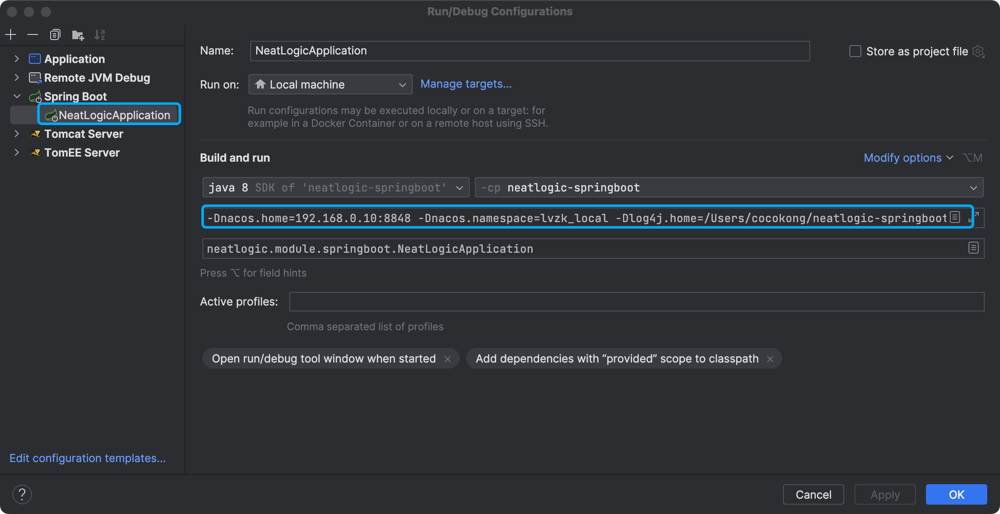
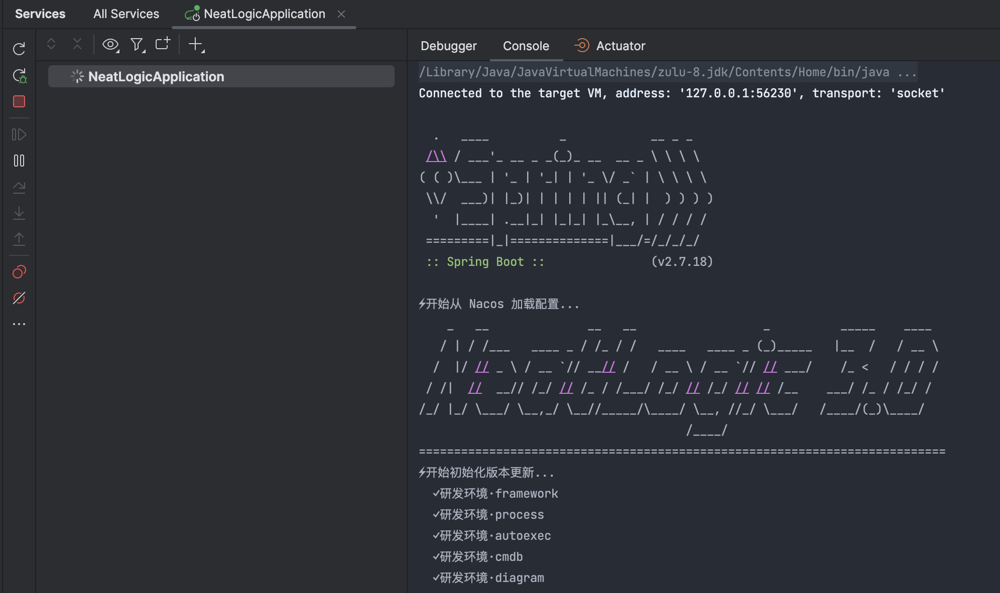

中文 / [English](README.en.md)

## 关于
neatlogic-springboot 使用springboot框架启动neatlogic后端项目

### linux环境部署项目
1. 将neatlogic-springboot模块通过maven打成neatlogic-springboot-0.3.0.0-SNAPSHOT.jar
2. 将上述打出来的jar和本模块下的config目录复制到同一个目录目录下，如下所示：
```
    -neatloigc
        -neatlogic-springboot-0.3.0.0-SNAPSHOT.jar
        -config
            -application.properties
            -config.properties
            -logback.xml
            -serverid.conf
```
3. 在jar所在目录执行启动命令
```
   java -Dlog4j.home=/neatlogic/logs -Dlog4j.priority=trace -Dfile.encoding=UTF-8 -Dnacos.home=192.168.0.10:8848 -Dnacos.namespace=neatlogic -DenableNoSecret=true -Xdebug -Xnoagent -Xrunjdwp:transport=dt_socket,server=y,suspend=n,address=5005 -XX:+UseConcMarkSweepGC -XX:+PrintGCDetails -XX:+PrintGCTimeStamps -XX:+HeapDumpOnOutOfMemoryError -verbose:gc -Xloggc:/neatlogic/logs/gc.log -Djava.io.tmpdir=/neatlogic/tmp -Djava.awt.headless=true -DenableNoSecret=true -Xbootclasspath/a:./config -jar neatlogic-springboot-0.3.0.0-SNAPSHOT.jar
```

### 研发环境IntelliJ IDEA启动项目
1. 需要将config目录标记为资源根目录

2. 设置VM options如下：
```
    //nacos配置，会优先使用nacos，获取不到config则会从config.properties中获取
    -Dnacos.home=192.168.0.10:8848
    -Dnacos.namespace=neatlogic
    //日志目录
    -Dlog4j.home=D:\logs2
    //日志级别
    -Dlog4j.priority=ERROR
    //设为true，输入用户名后可使用任意密码登录，只能在研发阶段使用！
    -DenableNoSecret=false
    //确保JVM使用UTF-8编码来解释和处理文本数据,否则可能会导致中文乱码
    -Dfile.encoding=UTF-8
```

3. 启动服务即可

